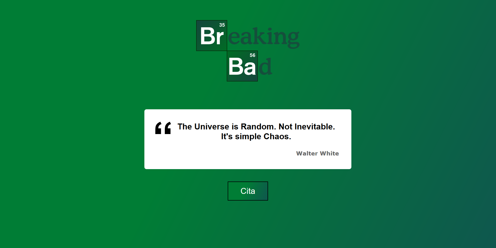

## Citas de Breaking Bad

Práctica:
- Componentes
- Eventos
- State (useState, useEffect)
- Consumir API de terceros
- Promesas con 'then'
- Promesas con 'async/await'
- Estilos con @emotion/styled

## Ejemplo

